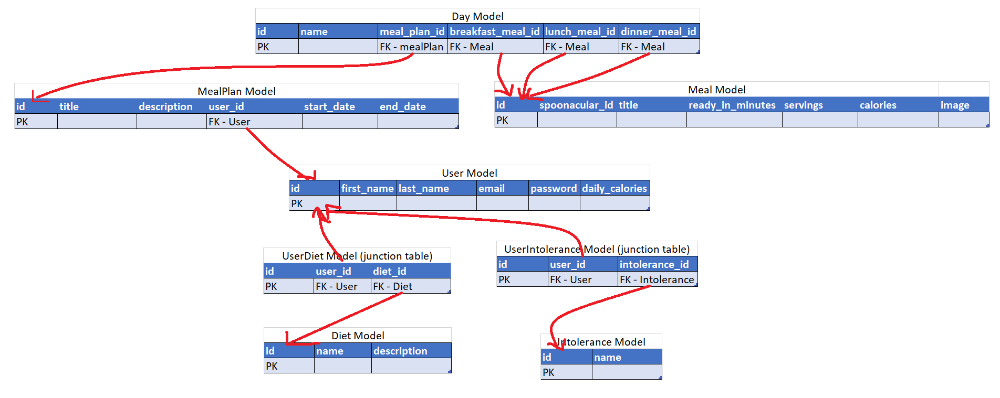
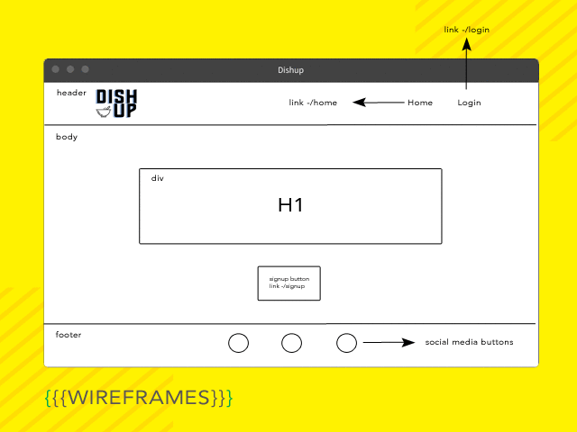
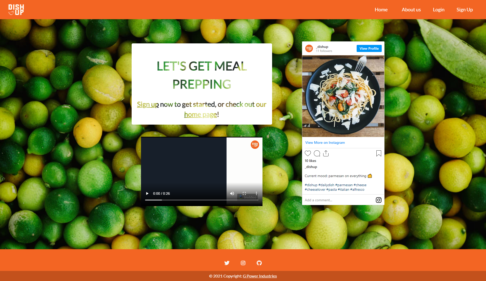
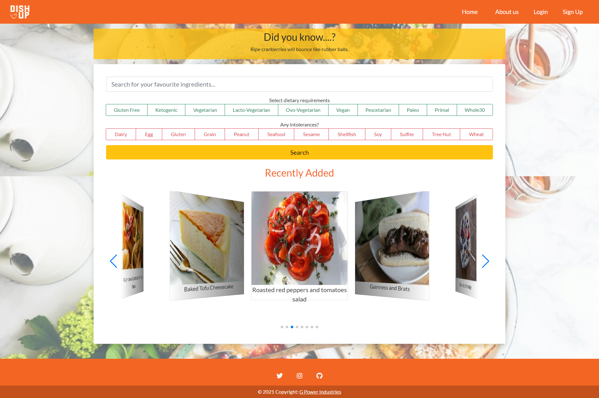
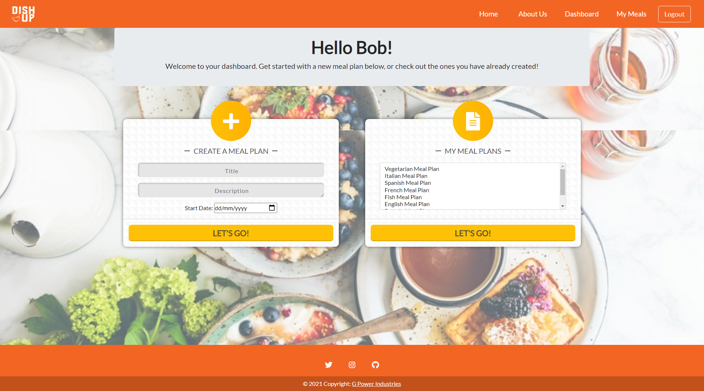
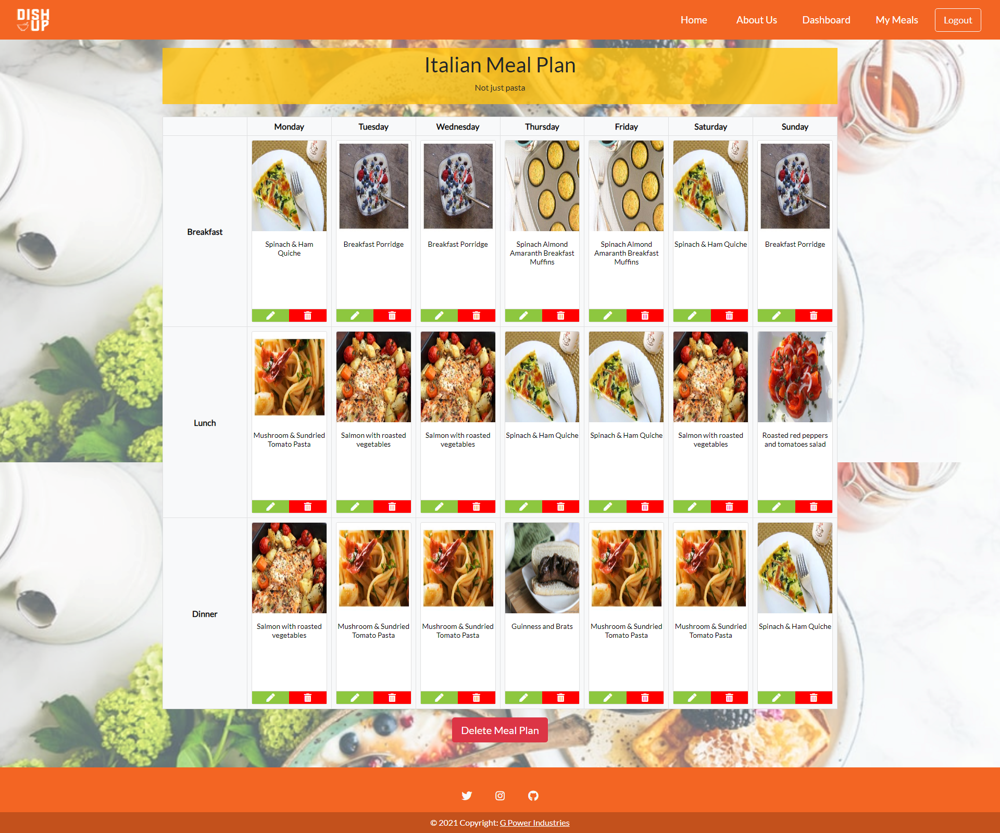
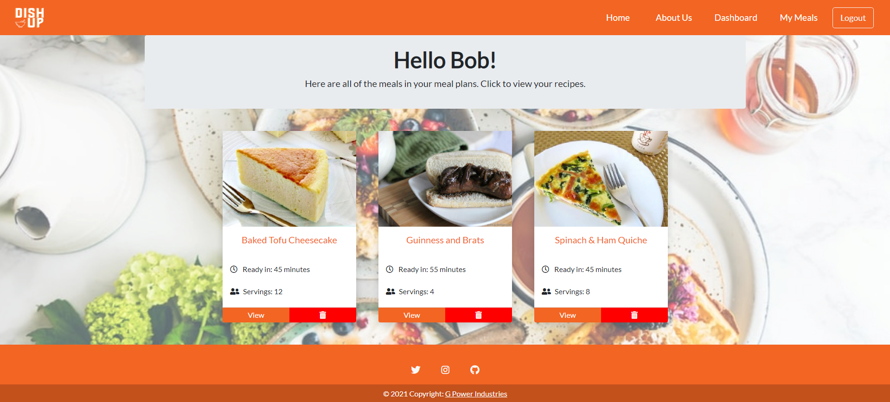

<h1> Dish Up  </h1>

A meal planning app to make your life as simple as possible, whilst enjoying delicious food.

We all know how long it can take to search the internet and find recipes which meet our dietary requirements and preferences, so we wanted to provide users with a solution to this. DishUp provides users the ability to easily search for food, using a range of possible filters for dietary requirements and intolerances. These meals can be saved to meal plans on the user profile, so they can be easily referred back to in the future.

Users can easily view the recipes for each meal they have chosen, handily stored in one place. There's no longer the need to pin your tabs to save recipes from lots of different websites!

Let us tell you more about the app below.

<h2> Table of Contents </h2>

- [Project Link](#project-link)
- [Getting Started](#getting-started)
  - [Installation](#installation)
  - [Set up the database](#set-up-the-database)
  - [Launch the app](#launch-the-app)
- [Contributors](#contributors)
- [About the Project](#about-the-project)
  - [User Flows](#user-flows)
  - [Technologies Used](#technologies-used)
  - [Web APIs](#web-apis)
  - [Model Framework](#model-framework)
  - [Wireframes](#wireframes)
- [Plans for Improvement](#plans-for-improvement)
- [Screenshots](#screenshots)

## Project Link

Click [here](https://natasha-mann.github.io/dish-up/) to view the project on GitHub pages.

## Getting Started

### Installation

```
git clone https://github.com/natasha-mann/dish-up.git
cd dish-up
npm i
```

You will also need to add your .env following the variables in the .env.EXAMPLE file.

### Set up the database

In MySQL workbench:

```
DROP DATABASE IF EXISTS dishup_db;

CREATE DATABASE dishup_db;
```

To seed the data:

```
npm run seed
```

### Launch the app

```
npm run start
```

## Contributors

- Chelsea: https://github.com/chelseanicholls95
- Pamela: https://github.com/PDUBB3
- Gemma: https://github.com/gemmac-coder
- Natasha: https://github.com/natasha-mann
- Farah: https://github.com/EEErban

## About the Project

### User Flows

### Technologies Used

For this project we used the following technologies:

- HTML
- CSS
- JavaScript
- jQuery
- Handlebars
- Node.js
- Express
- Sequelize
- MySql
- Bootstrap
- Bcrypt

### Web APIs

We used the [Spoonacular API](https://spoonacular.com/food-api) to get the required data for this project:

### Model Framework



### Wireframes



> Note:
> During implementation some of these features were improved or changed.

## Plans for Improvement

- Additional data on the dashboard
  - User stats (eg. popular meals)
  - Infographics + analytics
- Improve ease of adding meals
  - Allow user to add meals from the homepage search
- Sharing
  - Allow users to share their mealplans with others
  - Allow users to add friends within the app and view each other's meal plans
- Additional meal plan features
  - Creating shopping lists
  - Adding a weekly budget
  - Adding weekly calories options

## Screenshots






